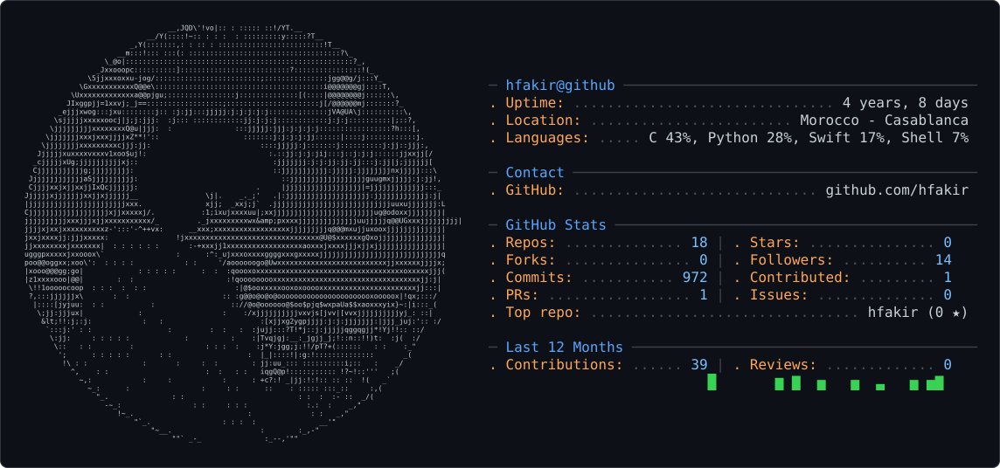

<picture>
  <source media="(prefers-color-scheme: dark)" srcset="dark_mode.svg" />
  <source media="(prefers-color-scheme: light)" srcset="light_mode.svg" />
  
</picture>

# 💫 About Me:
🔭 I'm currently working on iOS Apps & Swift Projects 👯 I'm looking to collaborate on Open Source iOS Projects 🤝 I'm looking for help with Advanced Swift & iOS Architecture 🌱 I'm currently learning Swift, SwiftUI & iOS Development 💬 Ask me about Swift, Mobile Development, or Programming basics ⚡ Fun fact: Coding with coffee while listening to lofi beats

## 🌐 Socials:
     

# 💻 Tech Stack:
                  

---

